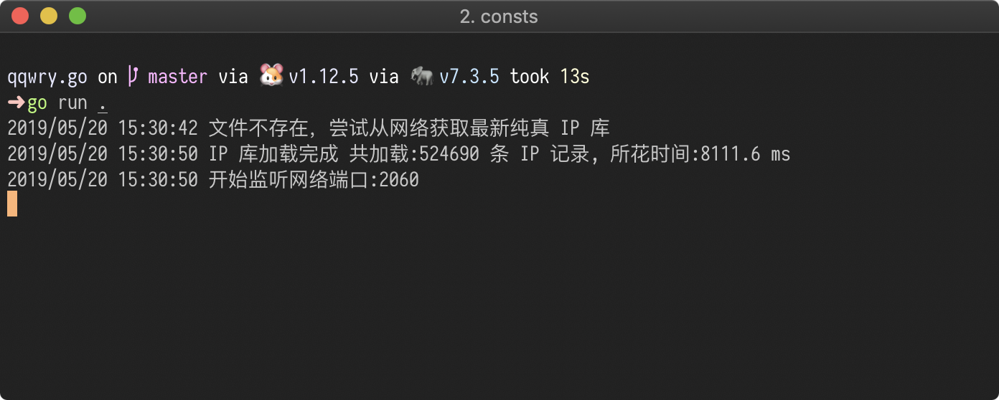

# qqwry.go

[](https://travis-ci.org/freshcn/qqwry)

通过 HTTP 提供一个 IP 地址归属地查询支持的微服务，使用纯真的 IP 库（支持直接在线获取和更新）。

## 介绍



我们大家做网站的时候，都会需要将用户的IP地址转换为归属地址功能，而之前的作法大都是从硬盘的数据文件中读取，这样不太高效。

这个微服务将纯真 IP 库直接加载到内存中，并以 HTTP 方式提供接口暴露出来（后续支持 GRPC），这样方便项目中所有的程序都能方便的接口 IP 查询功能。

## 安装

### Golang 的安装

```
go get github.com/freshcn/qqwry
```

### 二进制包直接下载

https://github.com/freshcn/qqwry/releases

### 在线获取最新的纯真 IP 库

默认支持在线获取最新的纯真 IP 库，解压缩到内村中并直接运行（需要网络的支持）。如果您想使用本地下载运行，请参考如下。

### 下载纯真IP库

访问 http://www.cz88.net 下载纯真IP库，需要在 Windows 中安装程序，然后在程序的安装目录可以找到 `qqwry.dat` 文件；也可以考虑运行使用 `download.go` 的 `GetOnline` 函数并将数据保存为本地文件。

将 dump 出来的 `qqwry` 文件放到和本程序同一目录（当然也可是其他目录，只是需要在运行的时候指定IP库目录），直接运行即可。

### 运行参数

运行 `./qqwry -h` 可以看到本服务程序的可用运行参数

```
  -port string
    	HTTP 请求监听端口号 (default "2060")
  -qqwry string
    	纯真 IP 库的地址 (default "./qqwry.dat")
```

## 使用方法

```
http://127.0.0.1:2060?ip=8.8.8.8,114.114.114.114&callback=a
```

* ip - 要查询的IP地址，可使用半角逗号分隔查询多个IP地址。必填项
* callback - jsonp回调函数名，当提交了这个参数，将会按jsonp格式返回。非必填

** 返回结果 **

```json
{"114.114.114.114":{"ip":"114.114.114.114","country":"江苏省南京市","area":"南京信风网络科技有限公司GreatbitDNS服务器"},"8.8.8.8":{"ip":"8.8.8.8","country":"美国","area":"加利福尼亚州圣克拉拉县山景市谷歌公司DNS服务器"}}
```

* ip - 输入的ip地址
* country - 国家或地区
* area - 区域（我实际测试得到还有可能是运营商）


### 感谢

* 感谢[纯真IP库](http://www.cz88.net)一直以来坚持为大家提供免费的IP库资源
* 感谢[yinheli](https://github.com/yinheli)的[qqwry](https://github.com/yinheli/qqwry)项目，为我提供了纯真ip库文件格式算法
* 感谢 https://zhangzifan.com/update-qqwry-dat.html 提供在线获取 IP 库的方案

`- eof -`